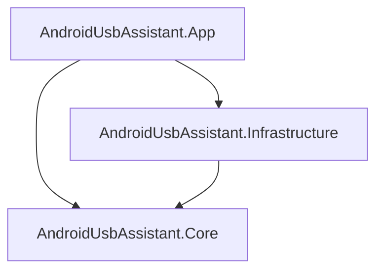
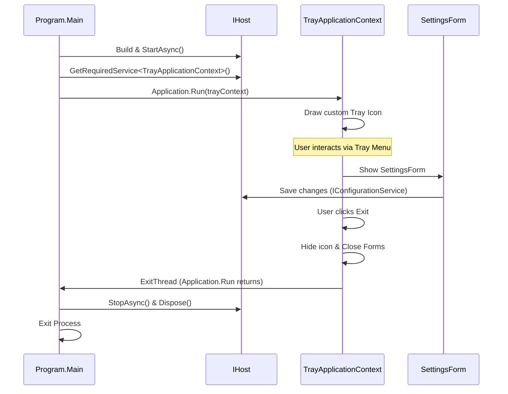

# Android USB Assistant - Architecture Documentation

This document describes the architectural design, layer responsibilities, and system integration patterns for the **Android USB Assistant** application.

## Clean Architecture Overview

The application follows the principles of Clean Architecture to ensure separation of concerns, testability, and extensibility. The project is split into three main layers:

### 1. Core Layer (`AndroidUsbAssistant.Core`)
* **Purpose**: Contains the domain models, business logic rules, and interface definitions.
* **Dependencies**: None. It is completely independent of external libraries, frameworks, UI components, or databases.
* **Key Components**:
  * `Models/AppConfiguration.cs`: Model representation of the application configuration settings.
  * `Interfaces/IConfigurationService.cs`: Interface defining the loading and persisting of settings.

### 2. Infrastructure Layer (`AndroidUsbAssistant.Infrastructure`)
* **Purpose**: Implements interfaces defined in the Core layer. It communicates with external systems (like the local file system, network, or OS).
* **Dependencies**: References `AndroidUsbAssistant.Core`.
* **Key Components**:
  * `Services/ConfigurationService.cs`: Implementation of `IConfigurationService` handling JSON serialization/deserialization of configuration state in `%LOCALAPPDATA%\AndroidUsbAssistant\settings.json`.

### 3. Application Layer (`AndroidUsbAssistant.App`)
* **Purpose**: The entry point, composition root, UI presentation, and configuration.
* **Dependencies**: References both `AndroidUsbAssistant.Core` and `AndroidUsbAssistant.Infrastructure`.
* **Key Components**:
  * `Program.cs`: The Composition Root which configures and starts the Microsoft Generic Host (`IHost`), sets up Dependency Injection, configures Logging, and executes the WinForms thread.
  * `TrayApplicationContext.cs`: Inherits from `ApplicationContext` to run the application in the system tray, managing the system tray icon, context menu, and forms life cycle.
  * `Forms/`: Dialog boxes for user interaction (e.g., `StatusForm`, `SettingsForm`, `AboutForm`).

---

## Generic Host & WinForms Lifecycle Integration

The application integrates `Microsoft.Extensions.Hosting` (Generic Host) with Windows Forms `ApplicationContext` to run them concurrently and ensure graceful shutdown.

### Graceful Shutdown Synchronizers
1. **From UI Exit**: Clicking "Exit" in the context menu calls `ExitThread()` which causes `Application.Run` to return, transitioning execution to stop and dispose the generic host.
2. **From External Stop**: If the host receives a termination command (e.g. CTRL+C or OS shutdown), `IHostApplicationLifetime.ApplicationStopping` is triggered. A registered event handler posts an exit action onto the UI thread via `SynchronizationContext.Current`, closing the tray application gracefully.
